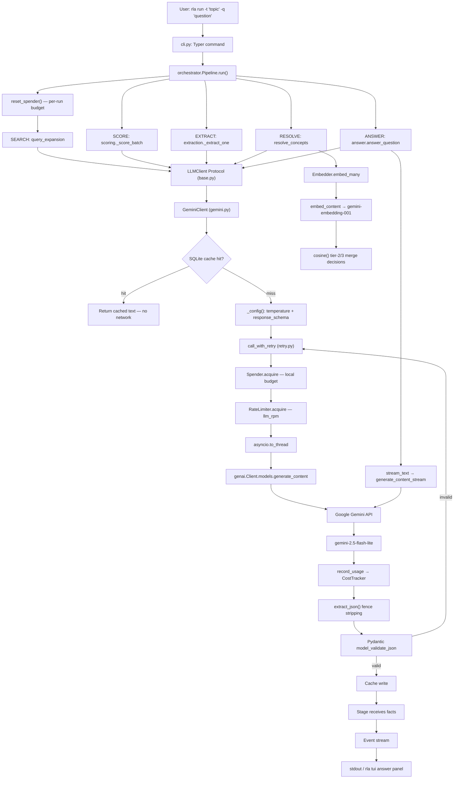
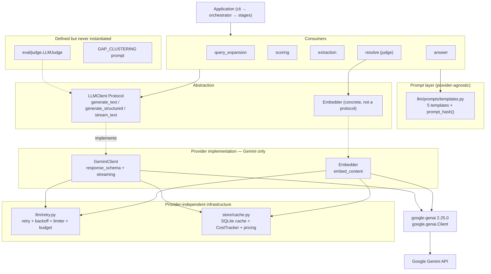

# LLM Architecture Audit

**Repository:** `rla` — graph-based research literature agent (`D:\Research_AI_Agent`)
**Audit type:** Read-only. No application code was changed, no dependency was added, no SDK was replaced.
**Date:** 2026-09-28
**Commit audited:** `4ddfbcc first commit` (the repository has exactly one commit, so no history-based intent is available)

Every claim below is tagged **CONFIRMED** (verified in code or by executing it), **INFERRED** (reasoned from code, not stated anywhere), or **UNKNOWN** (not determinable from the repository).

---

## Executive Summary

| Question | Answer |
|---|---|
| **Current provider(s)** | Google Gemini, exclusively. One provider, no second adapter. |
| **Current model(s)** | `gemini-2.5-flash-lite` (fast), `gemini-2.5-flash` (strong), `gemini-embedding-001` (embeddings). All three configurable via env. |
| **Current SDK(s)** | `google-genai` 2.25.0 (installed) / `>=0.3` (declared). Sync client wrapped with `asyncio.to_thread`. |
| **Primary LLM path** | `pipeline stage` → `LLMClient` Protocol → `GeminiClient._call` → SQLite cache → `call_with_retry` → `genai.Client.models.generate_content` |
| **Tool calling** | **Not used at all.** Zero function/tool declarations in the codebase. |
| **Structured output** | **Yes, and heavily.** 4 of 5 LLM call sites use Pydantic + `response_schema`. |
| **Streaming** | **Yes, one path only** — answer generation. Not used by extraction/scoring/resolution. |
| **Multimodal** | **None.** Text-only prompts throughout. |
| **Fallback** | **No fallback strategy currently implemented.** Degradation exists (keyless mode, per-stage fallbacks) but no alternative model or provider. |
| **Retry strategy** | Exponential backoff + jitter, up to 5 attempts, shared global rate limiter, plus a local per-run budget cap. |
| **Provider coupling** | **Low at the call-site layer, high in 3 places**: the client construction, cost pricing, and usage parsing. |
| **Main reliability dependency** | Gemini free-tier daily quota, which is per-model and cannot be paced around. |
| **Architecture type** | Single-provider adapter behind a hand-written `Protocol`, with a persistent cache as the de-facto resilience layer. |

**Three findings a future architect should read before anything else** (details in §16):

1. **`strong_model` is configured but never actually used for generation.** Both extraction and resolution accept a `model` parameter that is used *only* to label the cost report. The actual calls fall through to `fast_model`. This also means the cost report is mispriced.
2. **Cost estimation for `gemini-2.5-flash-lite` is wrong by 3×** because of a substring-matching bug in the pricing table lookup.
3. **Streaming responses are never metered**, so the single most expensive stage (answer generation) contributes zero tokens to the cost report.

---

## 1. Repository-wide investigation

### Structure relevant to AI calls

The repository is a single Python package. There is no `frontend/`, no `backend/`, no `services/`, no `package.json`, no `requirements.txt`, no Dockerfile, no CI config, and no `configs/` directory. Investigation therefore concentrated on `src/rla/`, `pyproject.toml`, `.env.example`, and the test suite.

```text
src/rla/
├── llm/                    <- the entire AI integration surface
│   ├── base.py             LLMClient Protocol, LLMError, usage parsing
│   ├── gemini.py           the ONLY provider implementation
│   ├── embeddings.py       the ONLY embedding implementation
│   ├── retry.py            pacing, backoff, budget
│   └── prompts/templates.py  5 prompts + prompt_hash()
├── pipeline/               5 stages that call the LLM
├── eval/                   judge.py (1 LLM judge, never instantiated)
├── store/cache.py          SQLite cache + CostTracker + pricing table
└── config.py               Settings, model IDs, budgets
```

### Search performed

Searched recursively for: SDK imports, client instantiation, `generate_*` calls, model identifiers, tool/function declarations, multimodal markers, thinking/reasoning config, safety settings, token limits, streaming, timeouts, retries, and queue/worker constructs.

| Search term | Result |
|---|---|
| `openai`, `anthropic`, `litellm`, `openrouter`, `vertexai` | **Zero hits** anywhere in the repository |
| `function_declarations`, `tool_config`, `tools=`, `FunctionDeclaration` | **Zero hits** — no tool calling exists |
| `Part.from`, `inline_data`, `mime_type`, `image`, `audio`, `video` | **Zero hits** — no multimodal input |
| `thinking_config`, `thinking_budget`, `reasoning_effort` | **Zero hits** — no reasoning/thinking configuration |
| `safety_settings` | **Zero hits** in `src/` (the SDK supports it; the app never sets it) |
| `system_instruction` | **Zero hits** — all instructions are inlined into the user prompt string |
| `max_output_tokens`, `context_window`, explicit token caps | **Zero hits** — no token budgets are set |
| `asyncio.Queue`, `Celery`, `celery`, worker/consumer loops | **Zero hits** — no background job system |
| proxy / gateway / `base_url` override | **Zero hits** — direct SDK connection only |
| `logging` / `logger` in `llm/` | **Zero hits** — observability is via the `Event` stream, not the logging module |

**Note on `top_k`:** `top_k` appears in `eval/baseline_rag.py:145` and `eval/run_eval.py:89`, but these are **retrieval** limits over papers, not LLM sampling parameters. They are unrelated to model configuration.

---

## 2. Exact models in use

Three distinct models. All are configurable by environment variable, none is hard-coded at a call site.

### Model 1 — Fast model (the de-facto default for all structured calls)

```text
Provider:   Google (Gemini API / AI Studio)
Model name: gemini-2.5-flash-lite
Model ID:   gemini-2.5-flash-lite
Family:     Gemini 2.5 Flash
Version:    2.5 (dated family; no finer version is pinned)
Purpose:    Every structured extraction call. Effectively the ONLY text model in use.
Configured: src/rla/config.py:33  (Settings.fast_model, env RLA_FAST_MODEL)
Exposed as: GeminiClient.fast_model property, src/rla/llm/gemini.py:60-61
Used by:    generate_text() src/rla/llm/gemini.py:135
            generate_structured() src/rla/llm/gemini.py:151
Selected:   implicitly, as the `model or self.fast_model` fallback when no model is passed
Role:       primary
Hard-coded: No — overridable via RLA_FAST_MODEL
```

**CONFIRMED.** It is the fallback in both `generate_text` and `generate_structured`, and no caller ever overrides it (§16.1).

### Model 2 — Strong model (configured and priced, but never used for generation)

```text
Provider:   Google (Gemini API / AI Studio)
Model name: gemini-2.5-flash
Model ID:   gemini-2.5-flash
Family:     Gemini 2.5 Flash
Version:    2.5
Purpose:    INTENDED for extraction/resolution quality. ACTUALLY used only to label
            cost reports (extraction.py:332, resolve.py:381) — see §16.1.
Configured: src/rla/config.py:34  (Settings.strong_model, env RLA_STRONG_MODEL)
Exposed as: GeminiClient.strong_model property, src/rla/llm/gemini.py:63-64
Used by:    stream_text() default, src/rla/llm/gemini.py:180
            cost labelling, src/rla/pipeline/orchestrator.py:242
Role:       nominally specialized; in practice the streaming/default model
Hard-coded: No — overridable via RLA_STRONG_MODEL
```

**CONFIRMED** that it is the default inside `stream_text` (`:180`).

**INFERRED** that no non-streaming generation uses it: `generate_text` and `generate_structured` both fall back to `fast_model`, and no call site passes `model=`. The three orchestrator call sites that *do* pass `model=self.settings.strong_model` (`orchestrator.py:287, 323`) hand it to stage functions that never forward it to the client — verified in §16.1.

### Model 3 — Embedding model

```text
Provider:   Google (Gemini API / AI Studio)
Model name: gemini-embedding-001
Model ID:   gemini-embedding-001
Family:     Gemini Embedding
Version:    GA (v3 generation; not date-suffixed)
Purpose:    Entity resolution — cosine similarity over concept "name + description"
Configured: src/rla/config.py:36  (Settings.embedding_model, env RLA_EMBEDDING_MODEL)
Instantiated: Embedder.client, src/rla/llm/embeddings.py:45-52
Called from:  Embedder.embed_one(), src/rla/llm/embeddings.py:64-67
              -> models.embed_content(model=..., contents=text)
Consumers:    resolve_concepts(), src/rla/pipeline/resolve.py:283
Role:       specialized
Hard-coded: No
```

**CONFIRMED.** The comment at `config.py:35` states `text-embedding-004` was retired and 404s, and this is the GA replacement. **UNKNOWN**: the exact output dimensionality is not asserted anywhere in the code. `cosine()` (`embeddings.py:19-27`) returns `0.0` on any length mismatch, so a future model with a different dimension count would silently collapse all similarity scores to zero rather than error.

### Selection logic

There is no routing, no scoring, and no dynamic selection. The rule is a two-line fallback:

```python
# gemini.py:135
return await self._call(prompt, model or self.fast_model, ...)
# gemini.py:151  (inside generate_structured)
text = await self._call(prompt, model or self.fast_model, ...)
# gemini.py:180  (inside stream_text)
return self.client.models.generate_content_stream(model=model or self.strong_model, ...)
```

**The only stage that ever reaches a "strong" model is answer generation**, and only because `stream_text` defaults differently from the other two methods. **CONFIRMED.**

---

## 3. SDK identification

| Property | Value |
|---|---|
| SDK name | `google-genai` |
| Python import name | `google.genai` |
| Declared version | `>=0.3` (`pyproject.toml:14`) |
| **Installed version** | **2.25.0** (verified via `pip list`) |
| Transitive deps present | `google-auth 2.58.1` (pulled in by the SDK) |
| Language | Python 3.11+ (`requires-python = ">=3.11"`) |
| Client class | `google.genai.Client` |
| Initialization | `genai.Client(api_key=...)` — `gemini.py:74`, `embeddings.py:51` |
| Transport | HTTPS to the Gemini API via the SDK's own HTTP stack. **Not** raw `httpx`. |
| Native or OpenAI-compatible? | **Native Gemini SDK.** No OpenAI-compatible surface anywhere. |
| Async? | **The SDK is synchronous.** The app wraps it: `asyncio.to_thread` in `gemini.py:107-108, 195` and `embeddings.py:64-67`. |

`httpx>=0.27` **is** a declared dependency (`pyproject.toml:10`) but is used exclusively for the academic source APIs (Semantic Scholar, OpenAlex, arXiv, DBLP, CrossRef) — **not** for LLM calls. **CONFIRMED** by inspecting every `httpx` usage under `src/rla/sources/` and `cli.py:274`.

### Two clients are constructed, not one

`GeminiClient` and `Embedder` each build their own `genai.Client` instance, and each caches it in a private `_client` attribute. They are not shared. This means a single run can hold two SDK client objects. Minor, but relevant to any future connection-pooling work.

---

## 4. The twelve architecture questions

### Q1. Which model are you using?

**CONFIRMED.** `gemini-2.5-flash-lite` for all four structured call sites (query expansion, relevance scoring, concept resolution judging, paper extraction) and for `generate_text`; `gemini-2.5-flash` only as the default inside `stream_text` (answer generation); `gemini-embedding-001` for concept embeddings. All three are set in `src/rla/config.py:33-36` and overridable by env var.

### Q2. Why was that model selected?

Three tiers of evidence, kept strictly separate:

**CONFIRMED reasons** (documented in code comments):

1. `config.py:31-32` — *"Free-tier keys report `limit: 0` for every Pro model, so the fast/strong split is drawn across the flash tier instead of failing at run time."* Both models are flash-tier because Pro models are unreachable on the available key.
2. `config.py:35` — *"text-embedding-004 was retired and now 404s; this is the GA replacement."*
3. `llm/base.py:3-4` — *"Only `GEMINI_API_KEY` is present on this machine, so Gemini is the shipped implementation."* Provider choice was dictated by credential availability, not evaluation.

**CONFIRMED intent that does not match the implementation:**

4. `PLAN.md:249` (risk register) — *"Flash-class model for extraction, pro-class only for synthesis."* The intent was for the **strong** model to do synthesis and flash to do extraction. In reality both do the flash-lite model; the strong model is only reachable via the streaming default. So the *documented* division of labour and the *actual* one have diverged.

**INFERRED:** the fast/strong split was intended to let a paid tier be substituted by changing one env var, without code edits. That intent is stated nowhere explicitly; it is inferred from the existence of the split and from the `doctor --llm` hint at `cli.py:215` (*"use a flash-tier model"*).

**UNKNOWN:** there is no benchmark, eval score, or quality comparison justifying the choice of flash-lite over flash for extraction. `PLAN.md` P2 and P3 are both marked *"implemented, gate unverified"*, so no live quality measurement exists.

### Q3. What exact Gemini features are being used?

Only these, all **CONFIRMED** by code inspection:

| Feature | Used? | Evidence |
|---|---|---|
| Text generation (`generate_content`) | **Yes** | `gemini.py:108` |
| Streaming (`generate_content_stream`) | **Yes, 1 path** | `gemini.py:179` |
| Structured output via `response_schema` | **Yes** | `gemini.py:85`; `model.model_json_schema()` at `:24` |
| JSON mode (`response_mime_type="application/json"`) | **Yes** | `gemini.py:84` |
| Embeddings (`embed_content`) | **Yes** | `embeddings.py:65` |
| Token usage metadata | **Yes** | `base.py:68-74` (`usage_metadata`) |
| Temperature control | **Yes** | `gemini.py:82`; always passed, defaults to 0.0 |
| System instructions | **No** — inlined into prompt text | zero hits |
| Function/tool calling | **No** | zero hits |
| Thinking / reasoning config | **No** | zero hits |
| Safety settings | **No** | zero hits (SDK supports them) |
| Token caps (`max_output_tokens`) | **No** | zero hits |
| Caching provider-side (context caching) | **No** | the app caches itself in SQLite |
| Vision / audio / video / files | **No** | zero hits |
| Batch API | **No** | — |

The two features that carry the most architectural weight are **structured output** and **streaming**; both are Gemini-shaped and are the main portability concerns (§11).

### Q4. Is tool/function calling required?

**No. Tool calling does not exist in this codebase, and nothing in the architecture requires it.** CONFIRMED by exhaustive search (§1) — zero hits for every tool-declaration API.

- Which tools exist: **none**
- How they would be declared: N/A
- Who would execute them: N/A
- How results would return to the model: N/A
- Parallel vs sequential tool calls: N/A
- Does the provider execute anything directly: **no**, the provider only generates text

This is a genuinely favourable finding for future portability: there is no tool-call schema to standardize, and no tool-execution loop to re-implement per provider.

### Q5. Is structured output required?

**Yes — this is the single most important LLM requirement in the system.** CONFIRMED.

Four of the five call sites demand schema-constrained output:

| Call site | Pydantic schema | Line |
|---|---|---|
| Query expansion | `QuerySet` | `query_expansion.py:28, 51` |
| Relevance scoring | `ScoreSet` | `scoring.py:58, 76` |
| Concept resolution judging | `Verdict` | `resolve.py:96, 214` |
| Paper extraction | `PaperFacts` | `extraction.py:98, 197` |

**Mechanism** (`gemini.py:81-86`): the Pydantic model is converted with `model.model_json_schema()` and passed to the SDK as `response_schema`, with `response_mime_type="application/json"`. This is Gemini's **server-side constrained decoding**, not prompt-level JSON instructions. Prompts *also* say "Return JSON" as a belt-and-braces measure (`templates.py:24, 63, 80`).

**Validation and failure handling** — a four-layer funnel:

1. **Layer 1 — SDK constraint.** The provider is asked to emit schema-valid JSON.
2. **Layer 2 — fence/prose stripping.** `extract_json()` (`gemini.py:27-37`) strips markdown fences and slices from the first `{` to the last `}`. Raises `LLMError` if no braces are found.
3. **Layer 3 — Pydantic validation with a self-correcting retry.** `generate_structured` (`gemini.py:147-161`) runs up to 3 attempts (`retries=2`). On `ValidationError`/`JSONDecodeError` it appends the error text to the prompt and tries again: *"Your previous output failed schema validation: {exc}. Return valid JSON only."*
4. **Layer 4 — stage-level degradation.** Each caller catches `LLMError` and degrades rather than aborting (see §10).

**Portability note (CONFIRMED):** layer 3's self-correction depends on the model being able to read a Pydantic error string and comply. It is a prompt-level contract, not a provider-level guarantee. Any provider with weaker structured-output support will push work into this retry loop, where the failure mode is a raised `LLMError`, not silent corruption — which is the safer failure.

### Q6. Is streaming required?

**Streaming is implemented, used by exactly one stage, and the system operates without it.** CONFIRMED.

- Protocol: `google.genai.models.generate_content_stream` (`gemini.py:179`), a **synchronous** iterator, so it is drained inside `asyncio.to_thread` and re-yielded as an async iterator (`gemini.py:195-199`).
- Where it begins: `answer.py:112`, the only `stream_text` call site.
- Where chunks are processed: `answer.py:113-126`. Chunks shorter than `_MIN_CHUNK` are dropped; each chunk passes through `validate_citations()`; surviving text is accumulated and emitted as an `Event(kind="delta")`.
- How chunks reach the user: `Event` objects → `rla run` prints them / `rla tui` renders them in the answer panel. `cli.py:405-408` supports `--jsonl`.
- Can the system operate without streaming? **Yes for everything except `answer` content.** `llm=None` yields a `pending` event and prints the traversed subgraph only (`answer.py:99-106`). The other four stages use non-streaming calls and are unaffected.

**Two caveats worth flagging:**

1. **Streaming is the only consumer of the "strong" model** (Q1). Removing it removes the only path to `gemini-2.5-flash`.
2. **Streaming is unmetered.** `stream_text` never calls `record_usage` (§16.3).

### Q7. Are images/audio/video/multimodal inputs involved?

**No. The system is text-only end to end.** CONFIRMED by zero hits for `Part.from`, `inline_data`, `mime_type`, or any modality keyword.

- Input types: strings only — paper titles, years, venues, and abstracts (`extraction.py:179-189`).
- Where they enter: from the academic source APIs as paper metadata, assembled into prompts by `str.format`.
- Preprocessing: whitespace normalisation, and truncation to `MAX_BODY_CHARS = 4000` (`extraction.py:34, 181-182`) with a literal `" [...]"` marker appended.
- Provider-specific format assumptions: **none found.** Prompts are plain `.format()` templates. This is a portability *strength*.

The one provider-shaped assumption is that the Gemini SDK's `contents` parameter accepts a bare `str` (`gemini.py:108`, `:181`) and that `embed_content` accepts `contents=text` (`embeddings.py:66`). Both are thin wrappers over the Gemini content model, but neither is exotic.

### Q8. What is the expected request volume?

**Not specified in repository** as a concurrency or traffic figure. No user-count, requests-per-minute target, or capacity plan exists. What *is* specified are **operational limits and their consequences**, which are CONFIRMED:

| Constraint | Value | Evidence |
|---|---|---|
| Free-tier ceiling | **~20 requests/day/model** | `retry.py:33-36` (`GenerateRequestsPerDayPerProjectPerModel-FreeTier`) |
| Local per-run cap | `llm_daily_budget = 15` per model | `config.py:63` |
| Local rate pacing | `llm_rpm = 15` per minute | `config.py:58` |
| Max retries | 5 | `config.py:59` |
| Stage concurrency | `max_concurrency = 4` (range 1–16) | `config.py:52` |
| Corpus target | 40–100 papers | `config.py:65-66` |
| Judge call cap | `MAX_JUDGE_CALLS = 40` | `resolve.py:42` |
| Semantic Scholar throttle | `s2_delay_seconds = 1.1` | `config.py:64` |

**Derived estimate, clearly labelled as an estimate:** a 100-paper corpus needs ≥100 extraction calls alone, which is 5× the observed daily free-tier ceiling. **A full pipeline cannot complete in one day on the free tier.** The `config.py:54-57` comment and `README.md:64` both acknowledge this, and `llm_daily_budget` exists specifically to make the failure clean and early rather than a 429 minutes later.

`retry.py:1-5` contains a **stale comment** claiming the free tier allows *"roughly 20 requests per minute per project"*, while `retry.py:33-36` correctly documents 20 **per day**. The module docstring contradicts its own constants. Minor, but it would mislead anyone estimating capacity.

### Q9. What is the budget model?

**Free tier, single-provider, with local self-limits.** CONFIRMED, no inference required.

Evidence: both default models are flash-tier "because free-tier keys report `limit: 0` for every Pro model" (`config.py:31-32`); `PLAN.md` P1 records that the configured key *"is an OAuth token"* so every scoring call returned 401; `README.md:137` lists "Gemini quota exhausted" as the top known constraint.

**Explicit cost-related constraints in the code:**

1. `llm_daily_budget = 15` — "Stops a large batch from spending the whole day's allowance on the first pass" (`config.py:59-63`).
2. `Spender.acquire()` raises `BudgetExhausted` *before* the request leaves the process (`retry.py:123-134`).
3. `is_daily_quota()` fails fast on a per-day 429 instead of retrying (`retry.py:40-51`).
4. `PLAN.md:143` — *"The free tiers are never rationed"* (a stated design principle).
5. Pricing table with per-model USD rates (`cache.py:23-28`).

**Self-hosted / local models: no evidence of any.** No Ollama, no llama.cpp, no vLLM, no local model path, no `torch`/`transformers` dependency. **CONFIRMED absent.**

**No secrets are recorded in this audit.** The only key variable is `GEMINI_API_KEY`, read via `Settings.gemini_api_key` (`config.py:26-30`). It is blank in the current `.env`.

### Q10. Which providers/models are acceptable fallbacks?

**No fallback strategy currently implemented.** CONFIRMED — no alternative provider, model, or adapter exists in the repository.

What *does* exist is **degradation**, which is a different and already-strong property. The system can lose its LLM and still produce a corpus:

| Condition | Behaviour | Evidence |
|---|---|---|
| No API key at all | Client is `None`; LLM stages emit `pending` and skip. Acquisition and graph still work. | `cli.py:78`, `orchestrator.py:174-180`, `answer.py:99-106` |
| Query expansion fails | Falls back to the raw title as the single search query | `query_expansion.py:55-63` |
| Scoring batch fails | Papers keep the default score of 3; not dropped | `scoring.py:98-103` |
| Extraction fails for one paper | That paper yields no extraction; batch continues | `extraction.py:200-201` |
| Judge fails or refuses | **Never merges** — falls toward duplicates | `resolve.py:219-220`, `PLAN.md` P3 |
| Embeddings unavailable | Drops to tier 1 (normalised name) with a warning | `PLAN.md` P3 degradation |

Note the *shape* of this: every fallback degrades **quality** but never **correctness**. The resolution stage's explicit refusal to merge on error is the clearest expression of that principle.

### Q11. Can the system tolerate different model behavior/quality?

Mostly yes for extraction; with specific hard points. Assessed per consumer:

| Assumption | Where | Tolerance |
|---|---|---|
| JSON schema compliance | `gemini.py:85` | **High.** Self-correcting retry ×3, then a clean `LLMError` per paper. One bad paper cannot sink a batch. |
| Enumerated string values (`"introduces" \| "uses"`, relation verbs) | `extraction.py:98`, `templates.py:45-49` | **High.** Constrained by `response_schema`; a deviating value fails validation rather than corrupting silently. |
| Citation IDs must match the subgraph | `answer.py:115`, `judge.py:125` | **High, and actively enforced.** Unsupported IDs are stripped and reported in `stripped_citations`. A model that invents `[P99]` is caught. |
| Temperature 0 ⇒ deterministic | `gemini.py:82`, `PLAN.md:231` | **Medium.** Determinism is *desired* but never *verified*. The extraction cache is content-hash keyed, so a re-run is stable regardless; a genuine re-extraction is not. |
| `query_expansion.py` returns exactly `count` queries | `query_expansion.py:65` | **Medium.** `QuerySet.queries` is capped at 8 and truncated to `count`. Under-delivery silently reduces coverage — PLAN.md P1 records a live run where this collapsed to 1 query. |
| Embedding vector dimensionality | `embeddings.py:19-27` | **Low. Silent-failure risk.** A dimension change makes `cosine()` return `0.0` for every pair, which disables tiers 2 and 3 of resolution **without raising**. |
| Answer prose quality / markdown | `answer.py:136` | **Low.** The only stage with no schema; a weaker model yields a worse narrative but nothing fails. |

**Components most likely to break on a provider change:** (1) `Embedder` if embedding dimensions differ; (2) the streaming default if a provider's stream API differs; (3) `extract_json()` if a provider returns arrays or bare scalars rather than a single object; (4) `usage_from_response()` — see below.

**A concrete portability trap, CONFIRMED by execution:** `base.py:66-74` reads tokens via `getattr(response, "usage_metadata", None)` and then `getattr(usage, "prompt_token_count", 0)`. Those are **Gemini-specific attribute names**. Any other provider returns `0, 0`, and the failure is **silent** — `record_usage` stores zeros, the cost report shows `$0.00`, and the run looks free. Note `CostTracker._is_priced` (`cache.py:75-81`) exists specifically to distinguish "unknown price" from "genuinely free", but it cannot catch this, because the model *name* is recognised while the *token counts* are silently zero.

### Q12. Is fallback allowed to produce different quality or behavior?

**No explicit requirement found.** CONFIRMED.

Nothing in `PLAN.md`, `README.md`, `AGENTS.md`, or the code states that a fallback model must behave equivalently, match quality, or be interchangeable. The only *implicit* quality bar is the general anti-fabrication principle throughout the prompts (`templates.py:94` "Never invent a citation id"; `templates.py:95-96` "If the subgraph does not contain the answer, say so explicitly").

Worth noting as the closest available signal: the resolution stage's refusal to merge on error (`resolve.py:219-220`) is an implicit preference for a *worse but honest* result over a *better but fabricated* one. That is a de-facto correctness-over-quality preference, but it is not stated as a general fallback policy.

---

## 5. Complete LLM pipeline

Reconstructed from the actual code. Stages marked *(absent)* do not exist and are omitted rather than invented.

```text
rla run -t "<topic>" -q "<question>"          cli.py:96-105
   │
   ▼
Pipeline.run()                               orchestrator.py:~98
   │  resets the per-run spender              orchestrator.py:110
   │
   ├─ SEARCH ─ query_expansion.expand_title  query_expansion.py:31
   │     └─▶ llm.generate_structured(QuerySet)          :51
   │           └─▶ GeminiClient._call                    gemini.py:88
   │                 ├─ SQLite cache lookup             :100-103
   │                 ├─ build config (response_schema)  :81-86
   │                 ├─ call_with_retry                 :110
   │                 │    ├─ Spender.acquire  (budget)  retry.py:123
   │                 │    ├─ RateLimiter.acquire        retry.py:91
   │                 │    └─ asyncio.to_thread          gemini.py:107
   │                 ├─ genai.Client.models.generate_content   :108
   │                 ├─ record_usage                    :118
   │                 ├─ extract_json + validate         :120-121, 154
   │                 └─ SQLite cache write              :123
   │
   ├─ FETCH ─ multi-source fan-out (httpx, NO LLM)     acquisition.py
   │
   ├─ SCORE ─ score_papers (batched)          scoring.py:92
   │     └─▶ generate_structured(ScoreSet)              :76
   │
   ├─ EXTRACT ─ extract_papers                extraction.py:205
   │     ├─ content-hash lookup in ExtractionStore      :219
   │     └─▶ generate_structured(PaperFacts)            :197
   │
   ├─ RESOLVE ─ resolve_concepts              resolve.py:229
   │     ├─ tier 1  normalised name (no model)
   │     ├─ tier 2  Embedder.embed_many                 resolve.py:283
   │     │           └─▶ genai embed_content  embeddings.py:65
   │     │     └─ tier 3  generate_structured(Verdict)  resolve.py:214
   │
   ├─ GRAPH ─ NetworkX build (NO LLM)         graph_build.py
   │
   ├─ TRAVERSE ─ pure functions (NO LLM)      traverse.py
   │
   └─ ANSWER ─ answer_question                answer.py:63
         ├─ traverse + build_prompt                    :77, 108
         └─▶ llm.stream_text(...)                     :112
               └─▶ genai generate_content_stream       gemini.py:179
                     └─ asyncio.to_thread drain       gemini.py:195
         ├─ validate_citations per chunk              answer.py:115
         └─ emit Event(kind="delta")                  answer.py:126
   │
   ▼
CostTracker (tokens/USD) + SQLite cache + Event stream → stdout / TUI
```

**Observations:**

- **Only 4 of 10 pipeline phases touch the LLM** (SEARCH, SCORE, EXTRACT, RESOLVE, ANSWER = 5). FETCH, GRAPH, TRAVERSE are pure-Python/NetworkX; FULLTEXT is an unimplemented placeholder.
- **Every LLM call is cache-first** (`gemini.py:100-103`, `embeddings.py:59-62`). A re-run is a pure cache replay, which `PLAN.md` P1 gates on.
- **Everything is async at the app layer, sync at the SDK layer**, bridged by `asyncio.to_thread`.

---

## 6. Feature-to-code map

| Feature | Provider/Model | SDK/API | File | Function/Class | Purpose | Provider-specific? |
|---|---|---|---|---|---|---|
| Structured output | Gemini / flash-lite | `response_schema` | `llm/gemini.py:23-24, 81-86` | `_schema_for`, `_config` | Constrain output to a Pydantic schema | **Yes** |
| JSON mode | Gemini | `response_mime_type` | `llm/gemini.py:84` | `_config` | Request JSON, not prose | **Yes** |
| Self-correcting retry | Gemini | — (app logic) | `llm/gemini.py:147-161` | `generate_structured` | Re-ask on validation failure | No |
| Fence stripping | Gemini | — (app logic) | `llm/gemini.py:27-37` | `extract_json` | Recover JSON from prose/fences | Partly |
| Text generation | Gemini / flash-lite | `generate_content` | `llm/gemini.py:108` | `_call` | Base text path | **Yes** |
| Streaming | Gemini / flash | `generate_content_stream` | `llm/gemini.py:179` | `stream_text` | Answer panel | **Yes** |
| Embeddings | Gemini / embedding-001 | `embed_content` | `llm/embeddings.py:65` | `embed_one` | Concept similarity | **Yes** |
| Token accounting | Gemini | `usage_metadata` | `llm/base.py:66-74` | `usage_from_response` | Cost report | **Yes** |
| Retry/backoff | Any | — (app logic) | `llm/retry.py:215-253` | `call_with_retry` | Survive transient errors | No |
| Rate limiting | Any | — (app logic) | `llm/retry.py:68-87`, `store/cache.py:31-46` | `get_limiter`, `RateLimiter` | Pace calls | No |
| Budget cap | Any | — (app logic) | `llm/retry.py:101-138` | `Spender` | Cap per-run spend | No |
| Daily-quota detection | **Gemini-specific error text** | — | `llm/retry.py:40-51` | `is_daily_quota` | Fail fast on per-day 429 | **Yes** |
| Auth-error detection | **Gemini-specific error text** | — | `llm/pipeline/extraction.py:161-164` | `_is_auth_error` | Stop systemic failures | **Yes** |
| Caching | Any | SQLite | `store/cache.py:114-174` | `Cache` | Zero-network re-runs | No |
| Prompt hashing | Any | — | `llm/prompts/templates.py:120-123` | `prompt_hash` | Invalidate on prompt edit | No |
| Citation validation | Any | — | `llm/../pipeline/answer.py:115` | `validate_citations` | Hallucination guard | No |
| Structured query expansion | Gemini / flash-lite | `generate_structured` | `pipeline/query_expansion.py:51` | `expand_title` | Title → 3-5 queries | No |
| Relevance scoring | Gemini / flash-lite | `generate_structured` | `pipeline/scoring.py:76` | `_score_batch` | Rank papers 1-5 | No |
| Paper extraction | Gemini / flash-lite | `generate_structured` | `pipeline/extraction.py:197` | `_extract_one` | Concepts/relations/limits | No |
| Merge judging | Gemini / flash-lite | `generate_structured` | `pipeline/resolve.py:214` | `_judge` | Alias decisions | No |
| Answer narrative | Gemini / flash | `stream_text` | `pipeline/answer.py:112` | `answer_question` | Cited answer | No |
| Cost estimation | Any | — (app logic) | `store/cache.py:23-28, 68-73` | `MODEL_PRICING`, `_price` | USD estimate | Partly |
| LLM judging (eval) | Any | `generate_text` | `eval/judge.py:241-311` | `LLMJudge` | Rubric scoring | No — **never instantiated** |

---

## 7. Calling infrastructure

| Question | Answer | Evidence |
|---|---|---|
| Where does the request originate? | Typer CLI command → `Pipeline.run()` | `cli.py:96`, `orchestrator.py` |
| Which process receives it? | Single local Python process. No server, no queue. | — |
| Which module decides the model? | `config.py` at startup; `gemini.py` at call time via `model or self.fast_model` | `config.py:33-36`, `gemini.py:135` |
| Which module creates the client? | `cli.py:78` → `GeminiClient`; lazily inside `.client` property | `cli.py:78, 173, 396`, `gemini.py:67-75` |
| Which module constructs the request? | `_config()` builds the config dict; `_call` assembles prompt+config | `gemini.py:81-86, 107-108` |
| Which module executes tools? | **N/A — no tools exist.** | §Q4 |
| Which module validates the response? | `extract_json` → Pydantic `model_validate_json` | `gemini.py:121, 154` |
| Which module handles errors? | `call_with_retry` raises `LLMError`; each stage catches and degrades | `retry.py:215-253` |
| Where are credentials loaded? | `GEMINI_API_KEY` → `Settings.gemini_api_key` → `genai.Client(api_key=...)` | `config.py:26-30`, `gemini.py:74` |
| Where is provider config stored? | `.env` at repo root, `RLA_` prefix, except the unprefixed key | `config.py:18-23` |
| Is there a proxy/gateway? | **No.** No `base_url`, no reverse proxy, no gateway. Direct SDK call. | zero hits |
| Is there a queue? | **No.** No `asyncio.Queue`, no broker, no background worker. | zero hits |
| Is there a worker? | **No.** Single event loop; `asyncio.Semaphore` bounds per-stage concurrency. | `config.py:52` |
| Sync or async? | **Async at app layer, sync at SDK layer**, bridged by `asyncio.to_thread`. | `gemini.py:107, 195` |
| Are there retries? | **Yes.** Up to 5, exponential backoff with jitter, `Retry-After` respected. | `retry.py:203-212, 232-252` |
| Circuit breakers? | **No true breaker.** No failure counter or half-open state. `is_daily_quota` and the auth check are *aggressive fail-fast* substitutes, not breakers. | `retry.py:40-51`, `extraction.py:161-164` |
| Are there fallbacks? | **No model/provider fallback.** Per-stage graceful degradation only. | §Q10 |
| Is there caching? | **Yes — SQLite, persistent, cache-first, no TTL, unbounded.** | `store/cache.py:114-174` |
| Observability/logging? | **`Event` stream, not `logging`.** Structured phase/kind/message/payload, consumed by `run --jsonl` and the TUI. No `logging` calls in `llm/`. | `events.py:45-60` |
| Where are tokens/costs recorded? | `CostTracker` per stage, printed at `Phase.DONE`. **Streams are not metered.** | `cache.py:49-111`, `orchestrator.py:242` |

**Cache characteristics worth flagging for any redesign (CONFIRMED by reading `store/cache.py:121-134`):** the schema is `(key, kind, value, created_at)` with `PRIMARY KEY (key, kind)`. There is **no TTL and no eviction** — the table grows without bound, and a stale response is indistinguishable from a fresh one. `created_at` is written but **never queried** for any purpose. Parameterized queries are used throughout (`:128, :148`), so there is no SQL-injection surface.

---

## 8. Environment variables and secrets

All values below are shown as read from `config.py`; **no secret values are reproduced**.

| Variable | Purpose | Required | Read at |
|---|---|---|---|
| `GEMINI_API_KEY` | Authenticates every Gemini call. **Unprefixed** via `validation_alias`. | Optional (system degrades keyless) | `config.py:26-30` |
| `RLA_FAST_MODEL` | Model ID for all structured calls | Optional, default `gemini-2.5-flash-lite` | `config.py:33` |
| `RLA_STRONG_MODEL` | Model ID default for streaming | Optional, default `gemini-2.5-flash` | `config.py:34` |
| `RLA_EMBEDDING_MODEL` | Embedding model ID | Optional, default `gemini-embedding-001` | `config.py:36` |
| `RLA_LLM_RPM` | Per-minute pacing | Optional, default 15 | `config.py:58` |
| `RLA_LLM_MAX_RETRIES` | Retry attempts per call | Optional, default 5 | `config.py:59` |
| `RLA_LLM_DAILY_BUDGET` | Local per-run, per-model request cap | Optional, default 15; 0 = uncapped | `config.py:63` |
| `RLA_MAX_CONCURRENCY` | Per-stage semaphore size | Optional, default 4 (1–16) | `config.py:52` |
| `RLA_S2_DELAY_SECONDS` | Semantic Scholar throttle (non-LLM) | Optional, default 1.1 | `config.py:64` |
| `RLA_SERPAPI_API_KEY` | Optional extra source (non-LLM) | Optional | `config.py:39` |
| `RLA_CORE_API_KEY` | Declared, **never read** by any code | Optional | `config.py:40` |
| `RLA_UNPAYWALL_EMAIL`, `RLA_GROBID_URL` | Phase-2 full text (unused) | Optional | `config.py:43-44` |
| `RLA_NEO4J_*` | Phase-2 export (unused) | Optional | `config.py:47-49` |

**Secret-handling assessment (all CONFIRMED):**

- `.env` is gitignored (`.gitignore:16`). `git check-ignore -v .env` confirms it.
- `.env.example` is **not** ignored, and contains **only blank values** — verified by inspecting every assignment line. Safe to commit.
- The API key never reaches a log, an `Event` payload, or the cache. `cli.py:124` prints the model name in the key's "detail" column, not the key.
- **Silent-failure risk worth knowing:** `Settings.model_config` sets `extra="ignore"` (`config.py:22`). I verified by execution that a wholly fictitious `RLA_TOTALLY_BOGUS` binds without any error. **A typo in a config variable is silently ignored**, and the app runs on defaults with no warning. This is the single most likely way for an operator to believe they configured something they did not.

---

## 9. Provider coupling analysis

### Hard coupling — a provider change requires code changes

| Coupling point | File | Impact of provider change |
|---|---|---|
| `from google import genai` + `genai.Client(api_key=...)` | `gemini.py:72-74`, `embeddings.py:49-51` | Import must be swapped; client construction rewritten |
| `client.models.generate_content(model=, contents=, config=)` | `gemini.py:108` | Gemini-shaped kwargs |
| `client.models.generate_content_stream(...)` | `gemini.py:179-183` | Gemini-shaped streaming API |
| `client.models.embed_content(model=, contents=)` | `embeddings.py:65-67` | Gemini-shaped embedding API |
| `config["response_mime_type"]` / `config["response_schema"]` | `gemini.py:84-85` | **Structured output contract.** The single most important coupling. |
| Usage parsing: `usage_metadata` / `prompt_token_count` / `candidates_token_count` | `base.py:68-74` | Gemini-only attribute names; wrong provider yields silent zeros |
| Pricing table keyed on Gemini model-ID substrings | `cache.py:23-28, 68-73` | Any non-Gemini model is priced at `$0.00` |
| `is_daily_quota` matches Gemini's 429 body text | `retry.py:37-51` | Non-Gemini quota errors are treated as ordinary retryable 429s |
| `_is_auth_error` matches error strings | `extraction.py:161-164` | Provider-specific heuristics |
| `LLMJudge` calls `client.generate_text` | `eval/judge.py:265+` | Inherits the `LLMClient` contract, so portable — but dead code |
| `LLMClient` Protocol type hints | `llm/base.py:22-63` | **Not a hard coupling** — see below |

### Soft coupling — changeable by configuration

| Coupling point | File | Impact |
|---|---|---|
| Model IDs as settings | `config.py:33-36` | **Any Gemini model, zero code change.** Verified: `RLA_FAST_MODEL` binds at runtime. |
| Fast/strong split | `gemini.py:60-64` | Already a two-tier abstraction |
| Optional features (SerpApi, Neo4j, GROBID) | `config.py:39-49` | Feature-gated by key presence |

### Capability coupling — depends on a provider-specific feature

| Coupling point | File | Impact |
|---|---|---|
| **Server-side structured output** | `gemini.py:81-86` | If a provider lacks schema-constrained decoding, correctness moves from *guaranteed* to *retried-then-failed*. Layer 3 (`gemini.py:147-161`) absorbs this at a latency and cost cost. |
| **Streaming** | `gemini.py:179` | Only used by answer generation; droppable without breaking the other four call sites. |
| **Per-model daily quota** | `retry.py:30-51` | The dominant architectural constraint. A provider without this would remove the entire budget subsystem. |
| **`generate_content` accepting a bare `str` for `contents`** | `gemini.py:108` | Minor; most SDKs accept this. |

### Behavioral coupling — assumes a model behaves a certain way

| Coupling point | File | Impact |
|---|---|---|
| Schema compliance + self-correction | `gemini.py:147-161` | A weaker model burns 3× the requests and then raises. Budget-constrained, so this can exhaust the daily cap. |
| Temperature 0 ⇒ determinism | `gemini.py:82`, `PLAN.md:231` | **Desired, never verified.** |
| Enumerated relation verbs returned verbatim | `templates.py:45-49` | Constrained by schema; deviation fails loudly. |
| Model returns a single JSON **object** | `gemini.py:34` (`find("{")` … `rfind("}")`) | A provider returning a top-level array would raise `LLMError`. |
| Embedding vector dimensionality | `embeddings.py:19-27` | **Silent failure** — `cosine()` returns 0.0, disabling resolution tiers 2-3 with no error. |
| Citation IDs copied verbatim | `answer.py:115` | Enforced; violations stripped. Provider-agnostic. |

### Overall coupling verdict

**The abstraction is real and unusually well-placed.** The `LLMClient` Protocol (`base.py:22-63`) is a three-method contract, and all five production call sites type against it rather than against `GeminiClient`. The architecture was clearly designed for this: `base.py:4-5` says *"another provider needs one class implementing `LLMClient` plus a key in config — no call sites change."*

**That claim is accurate, with one caveat.** Adding a second `LLMClient` would indeed leave call sites untouched. But the *client-construction* sites (`cli.py:78, 173, 396`) name `GeminiClient` explicitly, and there is no factory. So a second provider requires touching those three lines plus adding a class. That is a small, well-bounded change — not a rewrite — but the "no call sites change" phrasing overstates it slightly.

---

## 10. Reliability analysis

| Failure | Current behaviour | Retry? | Fallback? | User-visible effect |
|---|---|---|---|---|
| **Timeout** | **No timeout is set on any LLM call.** `retry.py:183` *catches* `asyncio.TimeoutError`, but nothing raises one. `request_timeout_seconds=30` (`config.py:67`) applies to source HTTP, not the LLM. A hung call can block a stage indefinitely. | No (nothing to retry) | No | Stage hangs. **Genuine gap.** |
| **429, per-minute** | Backoff with jitter, honours `Retry-After` | Yes, ≤5 | No | Slower stage, may still fail |
| **429, per-day quota** | `is_daily_quota` detects the per-day marker and **raises immediately** rather than burning 5×38s waits per paper | **No — fails fast by design** | No | Clean terminal error naming the daily limit (`retry.py:241-249`) |
| **Local budget spent** | `Spender.acquire` raises `BudgetExhausted` **before** the request leaves the process | No | No | Predictable early stop (`retry.py:123-134`) |
| **5xx / overload** | `is_retryable` → backoff + jitter | Yes, ≤5 | No | Stage may fail after 5 |
| **Auth failure (401/403)** | Non-retryable, so fails on attempt 1; `_is_auth_error` then **stops the whole extraction stage** rather than paying for N rejections | No (correct) | No | Terminal, explicit error |
| **4xx (400/404)** | Non-retryable; the caller may burn 100 identical requests if it does not have an auth check | No (correct) | No | See note below |
| **Malformed / non-JSON response** | `extract_json` raises `LLMError`; `generate_structured` retries ×3 with the validation error appended | Yes, ≤3 | No | `LLMError` → stage degradation |
| **Schema validation failure** | Same as above — 3 attempts, error text fed back | Yes, ≤3 | No | `LLMError` after 3 |
| **Tool-call failure** | **N/A** — no tools | — | — | — |
| **Network error / connection reset** | `is_retryable` matches `disconnected`, `connection reset`, `timed out`, etc. | Yes, ≤5 | No | Stage may fail |
| **Provider outage** | All LLM stages fail. Acquisition and graph build still work; the run degrades to a keyless corpus. | Yes, ≤5 per call | **Effectively yes** — keyless degradation | Corpus with no extractions; no graph (graph needs resolved concepts) |
| **Usage metadata absent** | `usage_from_response` returns `(0, 0)` | — | — | **Silent.** Cost report shows $0.00 |

**Two reliability gaps worth naming explicitly (both CONFIRMED):**

1. **No LLM call timeout.** A hung provider connection blocks the stage indefinitely. This is the most concrete reliability weakness found.
2. **`LLMError` wraps the stage name, not the operation.** `gemini.py:112` passes `stage=f"gemini call failed for stage {stage}"` into `call_with_retry`, which uses that as the error prefix — so the message reads `"gemini call failed for stage extraction: ..."` where the *stage* is fine and only the *call* failed. Cosmetic, but it makes real errors harder to scan.

---

## 11. Model/provider switching analysis

Ratings reflect the code as written, assuming a competent engineer and no behaviour change.

| Transition | Rating | Why |
|---|---|---|
| `gemini-2.5-flash-lite` → `gemini-2.5-flash` (or any Gemini model) | **Easy** | Pure config. Verified at runtime: `RLA_FAST_MODEL` binds and takes effect. `llm/gemini.py:61` reads `settings.fast_model` on every call. No code change, no call-site change. |
| `gemini-2.5-flash-lite` → `gemini-2.5-pro` | **Easy, with a caveat** | Config-only, but a Pro model returns `limit: 0` on a free-tier key (`config.py:31-32`). Requires a paid key. Also silently changes cost estimates, which are already mispriced (§16.2). |
| `gemini-embedding-001` → another embedding model | **Moderate** | Config-only, but `cosine()` (`embeddings.py:19-27`) returns `0.0` on a dimension mismatch **without raising**. Tiers 2 and 3 of entity resolution would silently stop working, and the failure would look like "no similar concepts found." Also, cached vectors under `kind="embed"` are keyed on the model name (`embeddings.py:55`), so old vectors will not be served to a new model — correct, but it means a full re-embed. |
| **Gemini → OpenAI** | **Moderate** | Write one class implementing `LLMClient` (`base.py:22-63`) — 3 methods, and the contract is small. Then fix three construction sites (`cli.py:78, 173, 396`), which name `GeminiClient` explicitly; there is **no factory**, so this is the part that is not "no call sites change." Add an `Embedder` equivalent. The genuine obstacles are: replacing `response_schema` with an equivalent structured-output mechanism, and rewriting `usage_from_response` for a different usage shape. **Estimated: one new client file plus a factory plus a test fixture.** No call-site changes needed. |
| **Gemini → Anthropic** | **Moderate** | Same as OpenAI. The pipeline is text-only and tool-free, so there is no tool-use schema to re-implement — a meaningful simplification. Structured output and usage parsing are the same two work items. |
| **Gemini → OpenRouter / LiteLLM Proxy** | **Easy to Moderate** | Easiest of the cross-provider moves *if* the proxy exposes an OpenAI-compatible surface: model IDs become config, and the client becomes a thin HTTP wrapper. But note the app's only HTTP client is `httpx` for sources, so a new `httpx` call path is new code rather than reuse. The two Gemini-shaped items still need handling. |
| **Gemini → LiteLLM SDK** | **Moderate** | LiteLLM's `response_format` and `usage` shapes would cover Q5 and Q11 respectively. Real work: a new `LLMClient` implementation, a factory, and deciding what happens to the Gemini-specific `is_daily_quota` string matching (`retry.py:37-51`) and the Gemini-keyed pricing table (`cache.py:23-28`). |
| **Cloud model → local model** | **Difficult** | Not a client-swap problem. There is no torch/transformers/serving dependency, no local model path, and no `PLAN.md` support for self-hosting. It would need new infrastructure (a local server, an embedding server, a new dependency), plus the dimension-mismatch issue above, plus a decision about whether local models meet the structured-output quality bar that the current free-tier flash models already meet. |

**Cross-cutting observation:** the *seams are well placed* — a 3-method Protocol, 5 dependent call sites, and no tools. The *hard parts are not the plumbing*; they are (1) structured-output parity, (2) token-usage parsing, and (3) whether the daily-quota subsystem is still meaningful under a different provider.

---

## 12. Dependency graph

```text
Application
    ↓
CLI  (typer)                          cli.py
    ↓
Pipeline orchestrator                 orchestrator.py
    │
    ├──→ query_expansion ─┐
    ├──→ scoring ─────────┤
    ├──→ extraction ──────┼──→ LLMClient (Protocol)          llm/base.py
    ├──→ resolve ─────────┤          ↑ implements
    └──→ answer ──────────┘          │
                                     └──→ GeminiClient       llm/gemini.py
                                              ↓
                                        google-genai 2.25.0
                                              ↓
                                        SQLite Cache (store/cache.py)
                                              ↓
                                        call_with_retry (llm/retry.py)
                                         ├─ RateLimiter   (60/rpm)
                                         ├─ Spender       (per-run budget)
                                         └─ backoff + jitter
                                              ↓
                                        asyncio.to_thread
                                              ↓
                              ┌───────────────────────────────┐
                              │  Google Gemini API            │
                              │  ├─ gemini-2.5-flash-lite     │ ← 4 structured stages
                              │  ├─ gemini-2.5-flash          │ ← streaming default
                              │  └─ gemini-embedding-001      │ ← entity resolution
                              └───────────────────────────────┘

Parallel branch (embeddings):
    resolve_concepts → Embedder (llm/embeddings.py)
                          ↓ same SDK, same key
                     gemini-embedding-001
```

**Single-provider, single-SDK, no gateway.** The only shared components between text and embedding paths are `Cache`, `CostTracker`, and `call_with_retry`.

---

## 13. Architecture diagrams

### Diagram A — Current LLM request flow



### Diagram B — Provider dependency map



---

## 14. Evidence and confidence

| # | Claim | Classification | Evidence |
|---|---|---|---|
| 1 | Three models, all configurable | **CONFIRMED** | `config.py:33, 34, 36` |
| 2 | `google-genai` is the only AI SDK | **CONFIRMED** | `pip list`; zero hits for openai/anthropic/litellm/openrouter |
| 3 | Installed SDK version 2.25.0 | **CONFIRMED** | `pip list` in the project venv |
| 4 | No tool calling exists | **CONFIRMED** | zero hits for all tool APIs |
| 5 | No multimodal input | **CONFIRMED** | zero hits for `Part.from`, `inline_data`, `mime_type` |
| 6 | No `system_instruction`; all prompts inlined | **CONFIRMED** | `gemini.py:108` passes `contents=prompt` |
| 7 | Structured output via `response_schema` | **CONFIRMED** | `gemini.py:24, 85` |
| 8 | 4 of 5 call sites are structured | **CONFIRMED** | `query_expansion.py:51`, `scoring.py:76`, `resolve.py:214`, `extraction.py:197` |
| 9 | Streaming used only by answer | **CONFIRMED** | single `stream_text` call, `answer.py:112` |
| 10 | Strong model never used for structured generation | **CONFIRMED** | `gemini.py:151` falls back to `fast_model`; no call site passes `model=` |
| 11 | Model selection is pure config | **CONFIRMED** | `RLA_FAST_MODEL` bound and took effect at runtime |
| 12 | Free-tier-per-day is the binding constraint | **CONFIRMED** | `retry.py:30-51`, `config.py:54-57`, `README.md:64` |
| 13 | Usage parsing is Gemini-specific | **CONFIRMED** | `base.py:68-74` attribute names |
| 14 | No timeout on LLM calls | **CONFIRMED** | no `timeout`/`wait_for` in `llm/`; `request_timeout_seconds` used by sources only |
| 15 | Streaming is not metered | **CONFIRMED** | `record_usage` absent from `stream_text` |
| 16 | `LLMJudge` never instantiated | **CONFIRMED** | only `run_eval.py:275` constructs a judge, and it is `HeuristicJudge` |
| 17 | `GAP_CLUSTERING` is dead | **CONFIRMED** | zero references outside its definition |
| 18 | `extra="ignore"` silently drops unknown vars | **CONFIRMED** | executed: `RLA_TOTALLY_BOGUS` bound without error |
| 19 | `.env` is gitignored, `.env.example` is not | **CONFIRMED** | `git check-ignore -v` |
| 20 | Cache has no TTL and no eviction | **CONFIRMED** | `cache.py:121-134`; `created_at` never queried |
| 21 | Gemini chosen because it was the only key available | **CONFIRMED** | `base.py:3-4` |
| 22 | Flash tier chosen because Pro is `limit: 0` on free tier | **CONFIRMED** | `config.py:31-32` |
| 23 | `text-embedding-004` retired → 001 substituted | **CONFIRMED** | `config.py:35` |
| 24 | Intended design was flash-extract / strong-synthesize | **CONFIRMED** | `PLAN.md:249` |
| 25 | A paid tier could be selected by config alone | **INFERRED** | from the fast/strong split and `cli.py:215` hint; stated nowhere |
| 26 | Free tier is ~20 req/day/model | **CONFIRMED** | `retry.py:33-36` names the exact quota id |
| 27 | A 100-paper run cannot finish in one day on the free tier | **INFERRED** (arithmetic) | 100 extraction calls vs a 20/day ceiling; `PLAN.md` P1/P2 corroborate |
| 28 | Adding a provider touches `cli.py:78, 173, 396` | **CONFIRMED** | those lines name `GeminiClient`; no factory exists |
| 29 | `base.py:4-5` "no call sites change" slightly overstates | **INFERRED** | call sites are clean, but construction sites are not |
| 30 | Expected user/request volume | **UNKNOWN** | no traffic or concurrency target in the repository |

---

## 15. Additional findings

Three defects surfaced during this audit that are outside the LLM-architecture question but directly affect any cost or model-selection decision. **No code was changed** — these are reported, not fixed.

### 16.1 — `strong_model` is never used for structured generation (CONFIRMED)

`orchestrator.py:287` and `:323` pass `model=self.settings.strong_model` into `extract_papers` and `resolve_concepts`. Both accept it (`extraction.py:212`, `resolve.py:235`), but the **only** use of the parameter is the cost-report label at `extraction.py:332` and `resolve.py:381`. Neither forwards it to `generate_structured`, so the calls fall through to `fast_model`.

Consequences:
- The documented fast/strong split (`PLAN.md:249`) does not operate. All structured extraction runs on flash-lite.
- Cost reports are priced against flash while the calls ran on flash-lite.

### 16.2 — `gemini-2.5-flash-lite` is mispriced 3× (CONFIRMED by execution)

`CostTracker._price` (`cache.py:68-73`) finds the pricing key by substring, iterating `MODEL_PRICING` in insertion order. `'gemini-2.5-flash'` is checked first and **is** a substring of `'gemini-2.5-flash-lite'`, so the lite model resolves to the full-flash rate.

```text
1,000,000 input tokens on gemini-2.5-flash-lite
  reported: $0.30
  correct:  $0.10   (table says 0.10/M)
  factor:   3x overcharge
```

For output tokens the error is 6.25× (2.50 vs 0.40). Every cost figure in the run report is inflated for the model actually in use.

### 16.3 — Streaming is unmetered (CONFIRMED)

`record_usage` is called at `gemini.py:118` (`_call`) and `embeddings.py:77`, but **not** in `stream_text`. Answer generation is the only stage using the nominally stronger model and the only long-form generation, so its tokens are entirely absent from `CostTracker`. The run's reported cost is a **lower bound** that excludes the answer stage.

### 16.4 — Stale module docstring contradicts the constants (CONFIRMED)

`retry.py:3-4` states the free tier allows *"roughly 20 requests per minute per project"*. `retry.py:33-36` correctly documents 20 **per day**. An operator reading only the module docstring would size capacity 1440× too high.

### 16.5 — Dead code (CONFIRMED)

- `eval/judge.py:241` `LLMJudge` — implemented, never instantiated. `run_eval.py:275` constructs `HeuristicJudge`. The eval harness therefore cannot produce an LLM-judged score today; `run_eval.py:26-27` and `:469` document this honestly.
- `llm/prompts/templates.py:106` `GAP_CLUSTERING` — no references anywhere in `src/` or `tests/`.
- `config.py:40` `core_api_key` — declared, never read.

---

## 16. What would change under each architectural option

Facts only, to support a later decision. **This audit makes no recommendation.**

| Consideration | Evidence-based finding |
|---|---|
| Tool-call portability | **Moot today** — zero tools exist. Any option is equally easy on this axis. |
| Structured-output portability | **The real cost centre.** 4 of 5 call sites depend on `response_schema` (`gemini.py:85`). Any option must supply equivalent schema-constrained decoding, or `generate_structured`'s 3-attempt retry (`gemini.py:147-161`) becomes the primary correctness mechanism — and it is budget-limited. |
| Usage/cost portability | **Blocked without code changes.** `base.py:68-74` reads Gemini-specific attributes; the pricing table (`cache.py:23-28`) is Gemini-keyed. Both are small, self-contained fixes, but they are *required*, not optional, and they will not announce themselves — they fail silently to `$0.00`. |
| Rate-limit/quotas | `is_daily_quota` (`retry.py:37-51`) matches Gemini's 429 body. Under a provider without a per-model daily cap, `Spender` and the daily-quota path become dead weight — removable, but their removal changes cost-control behaviour. |
| Streaming | One call site (`answer.py:112`); droppable. Losing it also removes the only path to `strong_model`. |
| Embeddings | Provider-specific, and dimension changes fail **silently** (`embeddings.py:19-27`). A second embedder is required for any non-Gemini target. |
| Client construction | Three sites name `GeminiClient` explicitly (`cli.py:78, 173, 396`); no factory. Any multi-provider option must add one. |
| Free-tier constraint | `PLAN.md` P2/P3 are marked "gate unverified" *because* of quota/credential problems. Provider options that carry quota would also reopen those gates. |

---

## Open Questions for Architecture Redesign

Scoped to what this repository actually makes relevant.

**About structured output (§Q5, §16.1)**
- Is Gemini's server-side `response_schema` the intended quality bar, or is the 3-attempt prompt-level retry (`gemini.py:147-161`) acceptable as the primary mechanism?
- If a fallback model must produce schema-valid output, what is the acceptable failure rate before the pipeline is considered degraded? The current design has no such threshold — a paper simply loses its extraction.
- Should `PaperFacts` (`extraction.py:98`) be narrowed to improve schema robustness, accepting less extraction coverage?
- Was the fast/strong split (`config.py:33-34`, `PLAN.md:249`) intended to be active? If so, §16.1 is a bug, and the audit's cost numbers change.

**About cost and metering (§16.2, §16.3)**
- Should the cost report be considered authoritative today, given that it is inflated 3–6.25× (§16.2) and excludes the answer stage entirely (§16.3)? Any cost-based decision made from the current output is unsound.
- Should streaming be metered per chunk, or metered from the final response's usage metadata after accumulation?
- Are cost figures needed per-request, or is per-stage attribution sufficient?

**About the free-tier constraint (§Q8, §Q9)**
- Is the ~20 req/day/model ceiling a permanent condition or a temporary one? The answer changes whether quota-handling code is core architecture or scaffolding.
- A 100-paper corpus needs ~5 days on the current ceiling. Is that acceptable, or does the design need to assume a paid key?
- Should `llm_daily_budget` (15) be raised once the key is confirmed paid? It currently blocks any run larger than 15 calls.

**About provider-independence (§9, §11)**
- `llm/base.py:4-5` claims a new provider needs "one class plus a key, no call sites change." Is it acceptable that `cli.py:78, 173, 396` also need editing, or is a client factory a prerequisite?
- Which is authoritative for portability: the `LLMClient` Protocol, or the wider surface (`Embedder`, `usage_from_response`, pricing, quota detection) that it does not cover? An abstraction covering only the first would leave §16.2-class defects unguarded.
- Should `usage_from_response` (`base.py:66-74`) be treated as part of the provider contract, given that violating it fails silently?

**About fallback semantics (§Q10, §Q12)**
- "No explicit requirement found" on behavioural equivalence (§Q12). Should one be written? The resolution stage's refuse-on-error policy (`resolve.py:219-220`) is the closest existing precedent.
- Is degrading to keyless/no-LLM mode (§Q10) the intended fallback, or is a second *model* wanted?
- If a fallback may produce lower quality, which stages may degrade silently and which must warn? Currently extraction degrades silently (skips a paper) while answer generation warns.

**About embeddings**
- Is the silent dimension-mismatch failure (`embeddings.py:19-27`) acceptable? A model change would disable resolution tiers 2-3 with no error and no log.
- Is embedding output dimensionality worth asserting at startup, as `rla doctor --llm` does for model reachability (`cli.py:194-201`)?

**About evaluation before committing to a redesign**
- `LLMJudge` is implemented but never wired (`eval/judge.py:241`, `run_eval.py:275`). Turning it on would give a quality baseline — and an acceptance criterion for any future model swap. Is that a prerequisite?
- `PLAN.md` P2 and P3 are "gate unverified" pending a working key (`PLAN.md:122-123, 152-153`). Should those gates be verified before, or as part of, a provider migration?
- Should the free-tier quota/credential situation (§16.4's stale docstring, `PLAN.md:103` OAuth token) be fixed first, so any comparison is made against a functioning baseline?

---

## Appendix A — Files inspected

**LLM integration (7 files, all read in full)**
`llm/base.py` (79 L) · `llm/gemini.py` (204 L) · `llm/embeddings.py` (88 L) · `llm/retry.py` (269 L) · `llm/prompts/templates.py` (123 L) · `config.py` (128 L) · `store/cache.py` (291 L)

**Call sites (6 files)**
`pipeline/orchestrator.py` (346 L) · `pipeline/extraction.py` (345 L) · `pipeline/resolve.py` (392 L) · `pipeline/answer.py` (207 L) · `pipeline/scoring.py` (138 L) · `pipeline/query_expansion.py` (67 L)

**Supporting**
`cli.py` (559 L) · `events.py` (85 L) · `eval/judge.py` · `eval/run_eval.py` (778 L) · `models.py` · all 22 test modules (grep-level, plus `conftest.py` in full)

**Config & docs**
`pyproject.toml` · `.env.example` · `.env` (keys blank; inspected without printing values) · `.gitignore` · `README.md` · `PLAN.md` · `AGENTS.md`

**Verified by execution**
SDK versions via `pip list`; SDK API surface via introspection of `google.genai.types.GenerateContentConfig`; model-ID binding via `RLA_FAST_MODEL` override; `.env` parsing via a non-default `RLA_LLM_DAILY_BUDGET`; `extra="ignore"` via a fictitious variable; both cost-reporting defects via `CostTracker`; git ignore status via `git check-ignore`.

## Appendix B — Audit method and limitations

**Method:** read every LLM-related file in full; grepped all 22 test modules and the full `src/` tree for every provider, tool, and modality API; introspected the installed SDK to confirm the config fields the app relies on; executed the pricing, config-binding, and cache paths to confirm behaviour rather than infer it; and checked every claim in `README.md`/`PLAN.md` against the code.

**Limitations, stated plainly:**

1. **No LLM call was made.** `GEMINI_API_KEY` is blank, so no live Gemini request was issued. Findings describe the code as written, not observed production behaviour. The SDK surface was verified by introspection, which is strong but not identical to a live round-trip.
2. **Single commit, no history.** `git log` shows one commit (`4ddfbcc first commit`), so design intent could not be recovered from commit messages or PR discussion. Q2 relies on in-code comments and `PLAN.md`.
3. **`PLAN.md` is treated as intent, not as truth.** Where it conflicts with the code — as in the fast/strong split (§16.1) and the per-minute vs per-day quota (`retry.py:3-4`) — this report records the conflict rather than picking a winner.
4. **Cost figures are relative.** The pricing table's *rates* were not checked against Google's current pricing (that would require an external lookup beyond this repository); the **lookup bug** in §16.2 was confirmed by executing the code.
5. **No test executes the real SDK.** Tests use fakes and `respx`; `GeminiClient` is monkeypatched in `test_p1_acquisition.py:981`. So SDK-behaviour assumptions are untested by the suite, and a future SDK upgrade could break them silently.
6. **Absent directories were not treated as findings.** There is no `frontend/`, `backend/`, `services/`, `package.json`, or CI config in this repository, so §1's search list was adapted rather than applied literally. Their absence is a fact about the project (a Python CLI/library), not an omission from the audit.
